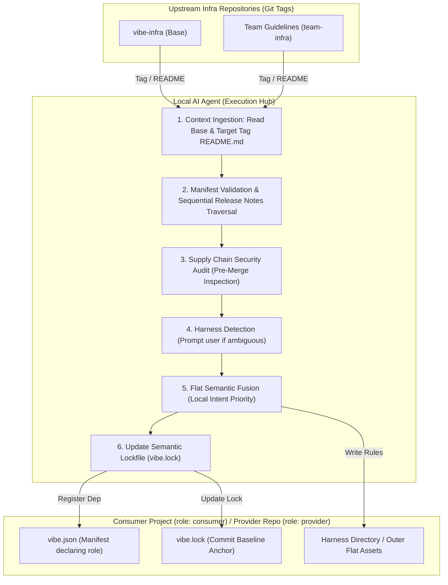

# vibe-infra

> **An Agent-Native Specification for Versioning, Distributing, and Fusing AI Infrastructure (Prompts, Skills, Commands)**
>
> [中文文档](README.zh-CN.md) | **English Documentation**

---

## Background & Technical Comparison

Managing decentralized Prompts, Skills, Commands, and Agent rules across projects introduces distribution challenges, harness divergence, and configuration conflicts. The table below outlines key differences between manual copying and the vibe-infra specification:

| Dimension | Traditional Approach | vibe-infra Specification |
| :--- | :--- | :--- |
| **Distribution & Sync** | Manual file copying; upstream guideline updates leave consumer repos out of sync. | **Declarative Manifest & Version Locking**: Dependencies declared in `vibe.json`; diff-upgrades executed via Git Tags. |
| **Harness Adaptation** | Mainstream AI programming tools (such as Claude Code) maintain divergent configuration paths. | **Harness Adaptation & Dual-Mode Placement**: Identifies environment (queries user if ambiguous); consumer projects adapt to harness paths while infra repos edit outer flat assets directly. |
| **Collision Resolution** | File overwriting breaks local rules or produces deeply nested directory trees. | **Flat Layout & Semantic Fusion**: Synthesizes identically named rules semantically without machine template pollution. |
| **Agent Context Awareness** | Agent inspects isolated Markdown snippets without understanding overall architectural intent. | **Mandatory Tagged README Ingestion**: Reads Base and target Tag `README.md` before execution (working memory only; never copied). |
| **Multi-Version Upgrades** | Upgrades skipping versions evaluate only end-to-end diffs, missing deprecation notices. | **Sequential Release Log Ingestion**: Traverses intermediate tags, sequentially processing Release Notes and Changelogs. |
| **Deprecation & Cleanup** | Pruning standards risks deleting local modifications or leaving dead instructions. | **Semantic Subtraction**: References the commit baseline recorded in `vibe.lock` to prune equivalent clauses while retaining local edits. |
| **Security Auditing** | Arbitrary prompt imports carry risks of credential harvesting or script injection. | **Pre-Merge Supply Chain Audit**: Static inspection flags sensitive credential access, destructive commands, or outbound calls. |

---

## Architecture & Workflow

The vibe-infra specification executes directly within the project's local AI Agent, requiring no external CLI binary:



---

## Quickstart

### 1. Consumer Project Initialization (Consumer Onboarding)

When introducing and consuming upstream AI Infra guidelines into standard projects, send this prompt to an active AI Agent (Claude Code or other mainstream agentic tools):

```markdown
Please read and follow the specification at https://github.com/seho-dev/vibe-infra to initialize vibe-infra as the Base Infrastructure for this consumer project:

1. Verify that https://github.com/seho-dev/vibe-infra contains a valid root vibe.json manifest.
2. Resolve the latest released stable Git Tag from https://github.com/seho-dev/vibe-infra.
3. Read and understand the Base Infra's README.md at that tag to ground understanding of vibe-infra conventions (Note: read for cognitive context only; never copy into workspace).
4. Detect the current project's AI host harness environment (e.g., Claude Code); if ambiguous, prompt me to confirm.
5. Fetch the AI infra configurations matching vibe-infra's includes expressions (commands/, prompts/, etc.) and adapt them into the appropriate native harness directories.
6. Create a `vibe.json` file in the project root explicitly declaring `role` as "consumer" and Base Infrastructure pinned to the resolved tag, ensuring `$schema` is included:
   {
     "$schema": "https://raw.githubusercontent.com/seho-dev/vibe-infra/main/schema.json",
     "role": "consumer",
     "infrastructures": {
       "base": {
         "url": "https://github.com/seho-dev/vibe-infra",
         "version": "latest"
       }
     }
   }
7. Generate the initial `vibe.lock` file in the project root recording the resolvedCommit and current timestamp, referencing lockfile.schema.json.
8. Conduct a supply-chain security audit on imported templates and commands.
9. If any naming conflicts, path ambiguities, or questions arise, actively ask for clarification as per prompts/shared-concepts.md.
10. Provide an initialization report summarizing the installed AI infra configurations, configuration paths, security audit outcomes, and next steps.
```

### 2. Infra Provider Repository Initialization (Provider Onboarding)

If authoring, distributing, or maintaining a team/enterprise AI Infra repository (extending `base` and managing assets flatly at root), send this prompt:

```markdown
Please read and follow the specification at https://github.com/seho-dev/vibe-infra to initialize this repository as a compliant Vibe Infra Provider Repository, importing Base Infra via flat pre-fusion:

1. Verify that https://github.com/seho-dev/vibe-infra contains a valid root vibe.json manifest.
2. Resolve the latest released stable Git Tag from https://github.com/seho-dev/vibe-infra.
3. Read the Base Infra README.md at that tag for cognitive grounding (never copy into workspace).
4. Detect the host AI programming harness; if ambiguous, prompt me to confirm.
5. Create a `vibe.json` file in the repository root explicitly declaring `role` as "provider", defining repository `name` and exported `includes` patterns, and declaring Base Infra as upstream:
   {
     "$schema": "https://raw.githubusercontent.com/seho-dev/vibe-infra/main/schema.json",
     "role": "provider",
     "name": "<your-infra-name>",
     "description": "<your-infra-description>",
     "includes": [
       "AGENTS.md",
       "skills/**/*.md",
       "commands/**/*.md",
       "prompts/**/*.md"
     ],
     "excludes": [
       "README*.md",
       "LICENSE"
     ],
     "infrastructures": {
       "base": {
         "url": "https://github.com/seho-dev/vibe-infra",
         "version": "latest"
       }
     }
   }
6. Perform provider flat pre-fusion: place Base distribution assets (commands/, prompts/, etc.) directly flat at the repository root for distribution, avoiding synthetic subfolders.
7. Generate initial `vibe.lock` recording Base's resolved commit SHA.
8. Output an initialization report summarizing the exported root assets and release guidelines.
```

### 3. Core Commands

Once initialized, the following commands manage the infrastructure lifecycle:

| Command | Action | Description |
| :--- | :--- | :--- |
| **`/vibe-add [url]@[tag]`** | Read Target & Base Tag READMEs ➔ Audit ➔ Semantic Fusion ➔ Update Lock | Introduce a new infrastructure dependency. |
| **`/vibe-sync`** | Read Base Tag README ➔ Sequential Release Traversal ➔ Cumulative Diff Merge | Synchronize upstream updates; updates harness paths in consumer mode, flat root assets in provider mode. |
| **`/vibe-remove [name]`** | Read Base Tag README ➔ Reference Commit Baseline ➔ Semantic Subtraction | Deregister dependency, safely pruning related clauses while preserving local edits. |

---

## Core Normative Axioms

All command executions strictly adhere to the standards formulated in **[prompts/shared-concepts.md](prompts/shared-concepts.md)**:

| Axiom | Requirement | Technical Boundary |
| :--- | :--- | :--- |
| **Manifest Gatekeeper** | Target repositories must provide a root `vibe.json`. | Missing manifests trigger immediate abortion; prevents arbitrary repository scraping. |
| **Explicit Workspace Role** | Manifests declare `role` as `"consumer"` or `"provider"`. | Disambiguates whether the workspace consumes packages or exports distribution assets. |
| **Tagged README Ingestion** | Ingest Base and target repository `README.md` at declared Tag before execution. | Ingested into Agent working memory for context only; **never** copied into workspace files. |
| **Harness Resolution & Inquiry** | Automatically detects mainstream harnesses; queries user if ambiguous. | Eliminates guesswork; guarantees files land in canonical directories. |
| **Dual-Mode Placement** | Consumers map to harness folders; Infra authors edit outer flat assets directly. | Infra authors run harness commands to maintain root assets flatly without synthetic folder nesting. |
| **Clean Markdown** | Documents must not contain synthetic machine markers (e.g., `<!-- vibe -->`). | Markdown remains standard human-readable text without source contamination. |
| **Publishing Pre-Fusion** | Derivative infras pre-fuse upstream rules; consumers maintain **direct-only lock**. | Eliminates runtime transitive dependency trees and diamond dependency conflicts. |
| **Sequential Release Traversal** | Traverse intermediate tags during multi-version upgrades to ingest Release Notes. | Systematically identifies deprecations and breaking changes across intermediate versions. |
| **Semantic Subtraction** | Reference the commit baseline from `vibe.lock` to assess file ownership. | Deletes exclusive untouched files; prunes equivalent clauses from fused files; protects local rules. |
| **Local Intent Precedence** | Project-specific build commands, constraints, and custom rules take precedence. | Upstream upgrades can never overwrite or discard local customizations. |
| **Supply Chain Security** | Static inspection for credential leaks, destructive commands, or outbound calls. | High-risk patterns halt execution and trigger interactive user confirmation. |

---

## Configuration File Formats

### 1. Consumer Project Manifest (`role: "consumer"`)
```json
{
  "$schema": "https://raw.githubusercontent.com/seho-dev/vibe-infra/main/schema.json",
  "role": "consumer",
  "infrastructures": {
    "base": {
      "url": "https://github.com/seho-dev/vibe-infra",
      "version": "latest"
    },
    "team-go": {
      "url": "https://github.com/example-org/team-go-infra.git",
      "version": "v0.2.1",
      "includes": ["skills/**/*.md"],
      "excludes": ["skills/legacy-*.md"]
    }
  }
}
```

### 2. Provider Infra Manifest (`role: "provider"`)
```json
{
  "$schema": "https://raw.githubusercontent.com/seho-dev/vibe-infra/main/schema.json",
  "role": "provider",
  "name": "team-go",
  "description": "Team Go coding conventions and AI commands",
  "includes": [
    "AGENTS.md",
    "skills/**/*.md",
    "commands/**/*.md",
    "prompts/**/*.md"
  ],
  "excludes": [
    "README*.md",
    "LICENSE"
  ],
  "infrastructures": {
    "base": {
      "url": "https://github.com/seho-dev/vibe-infra",
      "version": "latest"
    }
  }
}
```

### 3. Semantic Lockfile (`vibe.lock`)
Records resolved commit SHAs as semantic baselines without hash lists:
```json
{
  "$schema": "https://raw.githubusercontent.com/seho-dev/vibe-infra/main/lockfile.schema.json",
  "updatedAt": "2026-10-02T12:00:00Z",
  "infrastructures": {
    "base": {
      "url": "https://github.com/seho-dev/vibe-infra",
      "version": "v1.0.0",
      "resolvedCommit": "a1b2c3d4e5f6..."
    }
  }
}
```

---

## Authoring & Publishing an Infra Repository

1. **Define Root Manifest (`vibe.json`)**: Declare `role: "provider"`, repository `name`, and `includes` / `excludes`.
2. **Pre-Fuse Upstream (Optional)**: If extending `base`, declare it and run `/vibe-sync` before release tagging. The Agent reads and updates root flat assets directly.
3. **Publish Git Tag**: `git tag v1.0.0 && git push origin v1.0.0`.
4. **Publish GitHub Release (Recommended)**: Provide Release Notes to guide downstream semantic merges.

---

## Repository Structure

```text
vibe-infra/
├── commands/
│   ├── vibe-sync.md             # /vibe-sync pipeline definition
│   ├── vibe-add.md              # /vibe-add pipeline definition
│   └── vibe-remove.md           # /vibe-remove pipeline definition
├── prompts/
│   └── shared-concepts.md       # Core axioms and protocols specification
├── schema.json                  # JSON Schema validating vibe.json (declares role: consumer/provider)
├── lockfile.schema.json         # JSON Schema validating vibe.lock
├── vibe.json                    # Base Infra declaration manifest (role: provider)
├── LICENSE                      # MIT License
├── README.md                    # English documentation (This document)
└── README.zh-CN.md              # Chinese documentation
```

---

## License

[MIT](LICENSE) © 2026 seho-dev
