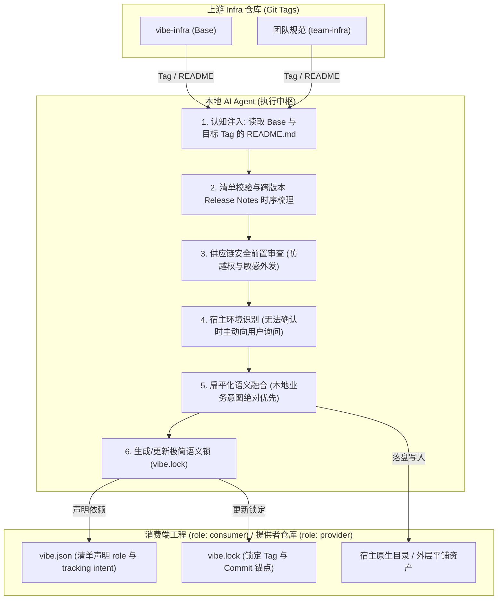

# vibe-infra

> **Agent 原生的 AI 基础设施（Prompts, Skills, Commands）版本管理与平铺融合规范**
>
> **中文文档** | [English Documentation](README.md)

---

## 解决的问题

在团队协作中，分散管理的 Prompts、Skills、Commands 和 Agent 规则面临分发困难、宿主环境割裂与规则冲突等问题：

| 维度 | 传统方式 | vibe-infra 规范方案 |
| :--- | :--- | :--- |
| **分发与升级** | 开发者手动复制文件；上游规范更新时存量工程无法同步升级。 | **声明式清单与版本锁定**：在 `vibe.json` 中声明依赖版本（默认声明 `latest` 追踪意图），在 `vibe.lock` 锁定具体 Commit 与 Tag，基于 Git Tag 差分升级。 |
| **多宿主适配** | 主流 AI 编程工具原生配置路径各不相同。 | **宿主自适应与双模归位**：自动识别环境（有歧义时主动询问）；消费端归位至宿主目录，提供者平铺直改外层资产。 |
| **多源冲突** | 传统文件覆盖破坏本地规则，或产生多层嵌套目录。 | **平铺布局与语义融合**：同名规则由 Agent 语义合成，无机器注释模板污染。 |
| **背景认知** | Agent 面对孤立的规则文件，缺乏对全局设计意图的理解。 | **强制 Tagged README 认知注入**：操作前必读 Base 与目标 Tag 的 `README.md` 建立认知（仅作上下文，不落盘）。 |
| **跨多版本升级** | 跨版本升级仅比对两端 Diff，遗漏中间版本的废弃说明与迁移指导。 | **时序发布日志串联摄取**：遍历区间内所有 Tag，串联 Release Notes 与 Changelog 演进时序。 |
| **注销清理** | 废弃规范时无法区分上游段落与本地修改，易误删或残留死代码。 | **语义减法**：基于 `vibe.lock` 记录的 Commit 锚点，精准剥离等价段落，保留本地定制。 |
| **配置安全** | 引入未知规则存在凭证索取或恶意脚本隐患。 | **供应链安全前置审查**：接入与升级时静态扫描敏感凭据访问、越权外连与危险 Shell 指令。 |

---

## 工作原理

vibe-infra 规范无需安装外置二进制 CLI 工具，工程内的本地 AI Agent **自身即为包管理器执行器**：



---

## 快速开始

### 1. 业务消费工程初始化（Consumer Onboarding）

在普通业务工程中引入并消费上游 AI Infra 规范时，向 Claude Code 等主流 AI 编程工具发送以下提示词：

```markdown
请阅读并按照 https://github.com/seho-dev/vibe-infra 的规范，将 vibe-infra 作为 Base Infra 初始化到当前消费端工程中：

1. 确认 https://github.com/seho-dev/vibe-infra 根目录存在合法的 vibe.json 清单文件。
2. 解析 https://github.com/seho-dev/vibe-infra 的最新发布 Git Tag（若无固定 Tag 则默认解析最新发布的 stable tag）。
3. 读取并理解 Base Infra 对应 Tag 的 README.md，明确 vibe-infra 的定位、规范与运行机制（注意：README 仅作为背景认知输入，严禁复制到工程中）。
4. 识别当前工程的 AI 编程工具环境（如 Claude Code 等）；若无法准确判断，主动向我提问确认。
5. 读取 vibe-infra 的 includes 匹配表达式，将其核心 AI infra 配置（commands/、prompts/ 等）适配并放置到宿主环境对应的原生配置目录下。
6. 对引入的配置进行供应链安全审查，排查敏感外连与恶意命令。
7. 在工程根目录下创建 vibe.json，显式声明 role 为 "consumer"，并将 Base Infra 声明为基础依赖（默认声明 version: "latest" 表达持续追踪最新版本的意图，由 vibe.lock 记录实际锁定的稳定 Tag 与 commit SHA），确保默认携带 $schema 字段：
   {
     "$schema": "https://raw.githubusercontent.com/seho-dev/vibe-infra/main/schema.json",
     "role": "consumer",
     "infrastructures": {
       "base": {
         "url": "https://github.com/seho-dev/vibe-infra",
         "version": "latest"
       }
     }
   }
8. 在工程根目录生成初始的 vibe.lock 文件，记录解析到的稳定 Git Tag（如 version: "v1.0.0"）、resolvedCommit 与当前时间戳，并关联 lockfile.schema.json。
9. 过程中若遇到任何路径判定、命名冲突或拿不准的问题，严格依据 prompts/shared-concepts.md 主动向我提问确认。
10. 完成后输出初始化报告，列出已安装的 AI infra 配置、放置路径、安全审计结论与后续步骤。
```

### 2. Infra 提供者仓库初始化（Provider Onboarding）

如果正在制作、维护或分发一个面向团队的 Infra 规范仓库（基于 `base` 扩展并将资产直接平铺在根目录），向 AI 发送以下提示词：

```markdown
请阅读并按照 https://github.com/seho-dev/vibe-infra 的规范，将当前仓库初始化为一个合规的 Vibe Infra 提供者仓库（Provider Repo），并引入 Base Infra 进行平铺预融合：

1. 确认 https://github.com/seho-dev/vibe-infra 根目录存在合法的 vibe.json 清单文件。
2. 解析 https://github.com/seho-dev/vibe-infra 的最新发布 Git Tag（默认解析最新 stable tag）。
3. 读取 Base Infra 对应 Tag 的 README.md 建立规范认知（严禁复制到工程中）。
4. 识别宿主 AI 编程工具环境；若无法准确判断，主动向我提问确认。
5. 在当前仓库根目录创建 vibe.json，显式声明 role 为 "provider"，定义当前仓库 name 与 includes 导出表达式，并将 Base Infra 声明为上游依赖（默认声明 version: "latest"）：
   {
     "$schema": "https://raw.githubusercontent.com/seho-dev/vibe-infra/main/schema.json",
     "role": "provider",
     "name": "<your-infra-name>",
     "description": "<your-infra-description>",
     "includes": [
       "AGENTS.md",
       "skills/**/*.md",
       "commands/**/*.md",
       "prompts/**/*.md"
     ],
     "excludes": [
       "README*.md",
       "LICENSE"
     ],
     "infrastructures": {
       "base": {
         "url": "https://github.com/seho-dev/vibe-infra",
         "version": "latest"
       }
     }
   }
6. 执行提供者模式平铺同步：将 Base 提供的核心资产（commands/、prompts/ 等）直接平铺融合在当前仓库根目录外层，供后续打包发布，严禁生成多层嵌套目录。
7. 在根目录生成初始的 vibe.lock 记录 Base 解析的 concrete Tag 与 commit SHA。
8. 询问用户是否添加 GitHub Release CI 工作流（Workflow）以辅助自动化发布版本：
   - 向用户清晰说明发布版本规则与运行机制：
     * **触发方式**：向 `main` 分支推送且提交信息以 `release` 或 `Release` 开头（如 `release: v1.0.0`），或通过 GitHub Actions 的 `workflow_dispatch` 手动触发（支持设置 `dry_run: true` 仅预览版本与 Release Notes 而不真正发布）。
     * **版本计算规则**（基于 semantic-release 语义化提交）：
       - 破坏性变更（提交含 `BREAKING CHANGE` 或 breaking 说明）：自动发布 **Major** 版本（例如 `v1.0.0` -> `v2.0.0`）；
       - 功能新增（提交以 `feat` 开头）：自动发布 **Minor** 版本（例如 `v1.0.0` -> `v1.1.0`）；
       - 问题修复（提交以 `fix` 开头）或其他常规提交：自动发布 **Patch** 版本（例如 `v1.0.0` -> `v1.0.1`）。
     * **发布产物**：自动计算新版本号、生成 Git Tag、生成 Release Notes 并发布 GitHub Release。
   - 若用户同意，将 vibe-infra 当前仓库下的 `.github/workflows/release.yml`（以及配套的 `.releaserc.json`）复制到当前仓库对应的 `.github/workflows/release.yml`（及根目录 `.releaserc.json`）。
9. 完成后输出初始化报告，列出根目录导出的平铺配置、CI 工作流配置情况及后续发布建议。
```

### 3. 日常指令速查

初始化完成后，工程原生支持以下生命周期指令：

| 指令 | 核心动作 | 典型场景 |
| :--- | :--- | :--- |
| **`/vibe-add [url]@[tag]`** | 读取目标与 Base Tag README ➔ 审计 ➔ 语义融合 ➔ 记录 Lock | 引入新的 Infra 依赖（默认写入 `latest` 意图并在 Lock 锁定稳定 Tag，亦支持显式 `@<tag>` 锁定）。 |
| **`/vibe-sync`** | 读取 Base Tag README ➔ 遍历跨版本 Release ➔ 累积 Diff 合并 | 同步上游更新；对齐 `latest` 最新 Tag 或显式锁定版本，消费端更新至宿主目录，提供者直接平铺更新至外层。 |
| **`/vibe-remove [name]`** | 读取 Base Tag README ➔ 锚定 Commit 基线 ➔ 语义减法剥离 | 注销指定依赖，安全清理关联配置并保留本地扩展。 |

---

## 核心公理与详细规范

本规范的所有公理定义、双模归位算法、跨版本时序遍历、配置文件 Schema 及发布指南均在 **[prompts/shared-concepts.md](prompts/shared-concepts.md)** 中标准化定义：

- **清单强制准入与角色定义**：`vibe.json` 与 `role` 声明（`consumer` / `provider`）。
- **清单意图与版本锁定分离**：`vibe.json` 依赖项默认声明 `"version": "latest"` 表达持续追踪最新发布的意图；而 `vibe.lock` 记录不可篡改的基线快照（精确的 Git Tag 与 Commit SHA）。
- **Tagged README 认知注入**：操作前必须读取对应 Tag 的 `README.md`，仅载入上下文，严禁落盘。
- **宿主识别与双模归位**：宿主环境自动识别（有歧义时主动向用户提问）；消费端归位至宿主原生目录，提供者直接平铺修改外层资产。
- **发布端预融合 (Pre-Fusion)**：上游依赖发布前预融合，消费端只维持单层锁，根治菱形依赖冲突。
- **跨版本时序发布日志摄取**：升级时时序串联全部中间 Tag 的 Release Notes 与 Changelog。
- **语义减法与本地意图优先**：基于 commit 锚点反向语义剥离，本地工程业务代码与构建命令永远不可覆盖。
- **供应链安全前置审查**：强制静态拦截敏感凭据访问、破坏性命令与未经声明的外连。

---

## 目录结构

```text
vibe-infra/
├── .github/
│   └── workflows/
│       └── release.yml          # GitHub Release 自动发布工作流
├── .releaserc.json              # 语义化发布规则配置
├── commands/
│   ├── vibe-sync.md             # /vibe-sync 管道定义
│   ├── vibe-add.md              # /vibe-add 管道定义
│   └── vibe-remove.md           # /vibe-remove 管道定义
├── prompts/
│   └── shared-concepts.md       # 规范核心公理、Schema 规范与发布指南 (Single Source of Truth)
├── schema.json                  # vibe.json 校验 Schema (定义 role: consumer/provider)
├── lockfile.schema.json         # vibe.lock 校验 Schema
├── vibe.json                    # 本仓库自身声明清单 (role: provider)
├── LICENSE                      # 开源协议
├── README.md                    # 英文文档
└── README.zh-CN.md              # 中文文档（本文档）
```

---

## 许可证

[MIT](LICENSE) © 2026 seho-dev
