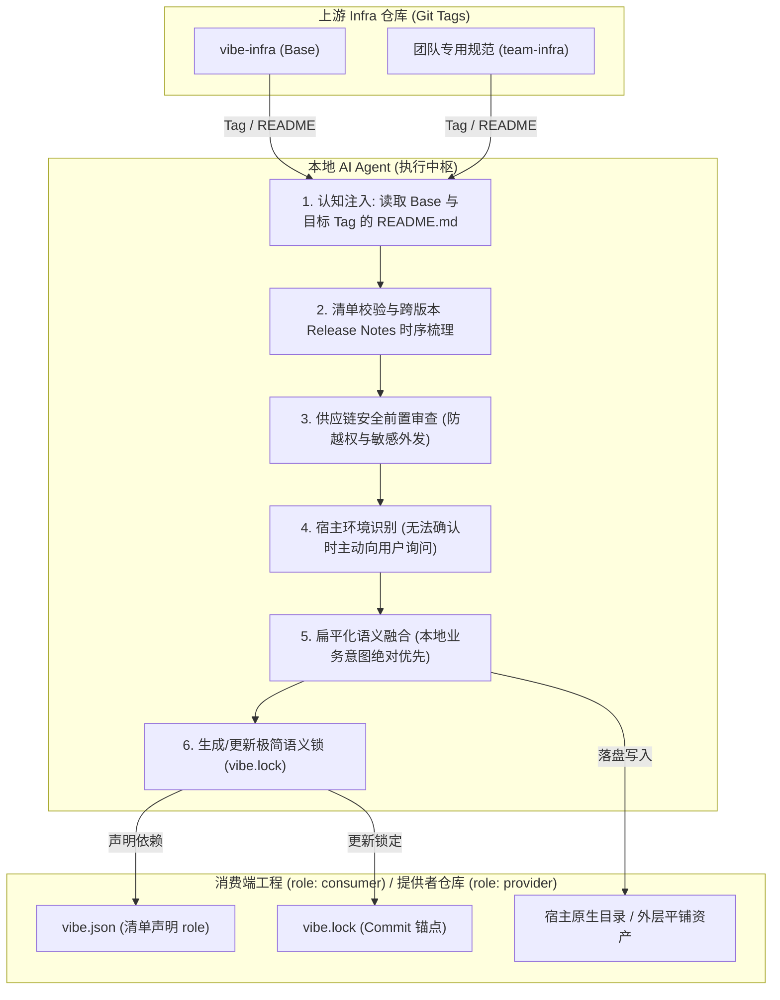

# vibe-infra

> **Agent 原生的 AI 基础设施（Prompts, Skills, Commands）版本管理与平铺融合规范**
>
> **中文文档** | [English Documentation](README.md)

---

## 问题背景与方案对比

工程中分散管理的 Prompts、Skills、Commands 和 Agent 规则在团队协作中面临分发困难、宿主环境割裂与规则冲突等问题。下表对比传统手动管理与 vibe-infra 规范的技术实现差异：

| 场景维度 | 传统方式 | vibe-infra 规范方案 |
| :--- | :--- | :--- |
| **规则分发与同步** | 开发者手动复制文件；上游规范更新时存量工程无法同步升级。 | **声明式清单与版本锁定**：在 `vibe.json` 中声明依赖版本，基于 Git Tag 差分升级。 |
| **多宿主环境适配** | 主流 AI 编程工具（如 Claude Code 等）原生配置路径各不相同。 | **宿主自适应与双模归位**：自动识别环境（无法确认时主动向用户询问）；消费端归位至宿主目录，Infra 提供者平铺直改外层资产。 |
| **同名与多源冲突** | 传统文件覆盖破坏本地规则，或产生多层嵌套目录。 | **平铺布局与语义融合**：同名规则由 Agent 语义合成，无机器注释模板污染。 |
| **Agent 背景认知** | Agent 面对孤立的 Markdown 规则文件，缺乏对全局设计意图的理解。 | **强制 Tagged README 认知注入**：操作前必须读取 Base 与目标 Tag 的 `README.md` 建立认知（仅作为上下文，不落盘）。 |
| **跨多版本升级** | 跨版本升级仅比对两端 Diff，遗漏中间版本的废弃说明与迁移指导。 | **时序发布日志串联摄取**：遍历区间内所有 Tag，串联 Release Notes 与 Changelog 演进时序。 |
| **依赖注销与清理** | 废弃规范时无法区分上游段落与本地修改，易误删或残留无效规则。 | **语义减法**：基于 `vibe.lock` 记录的 Commit 锚点，精准剥离等价段落，保留本地定制。 |
| **配置安全性** | 引入未知规则存在凭证索取或恶意脚本隐患。 | **供应链安全前置审查**：接入与升级时静态扫描敏感凭据访问、越权外连与危险 Shell 指令。 |

---

## 系统架构与工作流

vibe-infra 规范由工程内的 AI Agent 直接作为执行器运行，无需安装额外的二进制 CLI 工具：



---

## 快速开始

### 1. 业务消费工程初始化（Consumer Onboarding）

在普通工程中引入并消费上游 AI Infra 规范时，向 Claude Code 等主流 AI 编程工具发送以下提示词：

```markdown
请阅读并按照 https://github.com/seho-dev/vibe-infra 的规范，将 vibe-infra 作为 Base Infra 初始化到当前消费端工程中：

1. 确认 https://github.com/seho-dev/vibe-infra 根目录存在合法的 vibe.json 清单文件。
2. 解析 https://github.com/seho-dev/vibe-infra 的最新发布 Git Tag（若无固定 Tag 则默认解析最新发布的 stable tag）。
3. 读取并理解 Base Infra 对应 Tag 的 README.md，明确 vibe-infra 的定位、规范与运行机制（注意：README 仅作为背景认知输入，严禁复制到工程中）。
4. 识别当前工程的 AI 编程工具环境（如 Claude Code 等）；若无法准确判断，主动向我提问确认。
5. 读取 vibe-infra 的 includes 匹配表达式，将其核心 AI infra 配置（commands/、prompts/ 等）适配并放置到宿主环境对应的原生配置目录下。
6. 对引入的配置进行供应链安全审查，排查敏感外连与恶意命令。
7. 在工程根目录下创建 vibe.json，显式声明 role 为 "consumer"，并将 Base Infra 声明为基础依赖并锁定解析到的 Tag，确保默认携带 $schema 字段：
   {
     "$schema": "https://raw.githubusercontent.com/seho-dev/vibe-infra/main/schema.json",
     "role": "consumer",
     "infrastructures": {
       "base": {
         "url": "https://github.com/seho-dev/vibe-infra",
         "version": "latest"
       }
     }
   }
8. 在工程根目录生成初始的 vibe.lock 文件，记录 resolvedCommit 与当前时间戳，并关联 lockfile.schema.json。
9. 过程中若遇到任何路径判定、命名冲突或拿不准的问题，严格依据 prompts/shared-concepts.md 主动向我提问确认。
10. 完成后输出初始化报告，列出已安装的 AI infra 配置、放置路径、安全审计结论与后续步骤。
```

### 2. Infra 提供者仓库初始化（Provider Onboarding）

如果你正在制作、维护或分发一个面向团队的 Infra 规范仓库（需要基于 `base` 扩展并将资产直接平铺在根目录），向 AI 发送以下提示词：

```markdown
请阅读并按照 https://github.com/seho-dev/vibe-infra 的规范，将当前仓库初始化为一个合规的 Vibe Infra 提供者仓库（Provider Repo），并引入 Base Infra 进行平铺预融合：

1. 确认 https://github.com/seho-dev/vibe-infra 根目录存在合法的 vibe.json 清单文件。
2. 解析 https://github.com/seho-dev/vibe-infra 的最新发布 Git Tag（默认解析最新 stable tag）。
3. 读取 Base Infra 对应 Tag 的 README.md 建立规范认知（严禁复制到工程中）。
4. 识别宿主 AI 编程工具环境；若无法准确判断，主动向我提问确认。
5. 在当前仓库根目录创建 vibe.json，显式声明 role 为 "provider"，定义当前仓库 name 与 includes 导出表达式，并将 Base Infra 声明为上游依赖：
   {
     "$schema": "https://raw.githubusercontent.com/seho-dev/vibe-infra/main/schema.json",
     "role": "provider",
     "name": "<your-infra-name>",
     "description": "<your-infra-description>",
     "includes": [
       "AGENTS.md",
       "skills/**/*.md",
       "commands/**/*.md",
       "prompts/**/*.md"
     ],
     "excludes": [
       "README*.md",
       "LICENSE"
     ],
     "infrastructures": {
       "base": {
         "url": "https://github.com/seho-dev/vibe-infra",
         "version": "latest"
       }
     }
   }
6. 执行提供者模式平铺同步：将 Base 提供的核心资产（commands/、prompts/ 等）直接平铺融合在当前仓库根目录外层，供后续打包发布，严禁生成多层嵌套目录。
7. 在根目录生成初始的 vibe.lock 记录 Base 解析的 commit SHA。
8. 完成后输出初始化报告，列出根目录导出的平铺配置及后续发布建议。
```

### 3. 核心指令集

初始化完成后，工程支持以下生命周期指令：

| 指令 | 阶段动作 | 说明 |
| :--- | :--- | :--- |
| **`/vibe-add [url]@[tag]`** | 读取目标与 Base Tag README ➔ 审计 ➔ 语义融合 ➔ 记录 Lock | 引入新的 Infra 依赖（例如团队 Go 规约、前端规范）。 |
| **`/vibe-sync`** | 读取 Base Tag README ➔ 遍历跨版本 Release ➔ 累积 Diff 合并 | 同步上游更新；消费端更新至宿主目录，提供者直接平铺更新至外层。 |
| **`/vibe-remove [name]`** | 读取 Base Tag README ➔ 锚定 Commit 基线 ➔ 语义减法剥离 | 注销指定依赖，安全清理关联配置并保留本地扩展。 |

---

## 核心规范与公理

所有命令与合并操作严格遵守 **[prompts/shared-concepts.md](prompts/shared-concepts.md)** 所定义的规范要求：

| 规范条目 | 约束要求 | 技术边界 |
| :--- | :--- | :--- |
| **清单准入 (Manifest Gatekeeper)** | 目标仓库根目录必须提供有效的 `vibe.json`。 | 缺少清单则强制终止操作，杜绝非法仓库抓取。 |
| **角色区分 (Explicit Role)** | `vibe.json` 中显式通过 `role` 声明 `"consumer"` 或 `"provider"`。 | 明确当前工程是应用层消费依赖还是基础层分发规范。 |
| **Tagged README 认知注入** | 操作前必须读取 Base 与目标仓库在对应 Tag 下的 `README.md`。 | 仅载入 Agent 上下文用于语义理解，**严禁**复制或写入至工程目录。 |
| **宿主识别与主动提问** | 自动识别主流工具环境；无法确定或存在歧义时强制向用户提问。 | 严禁盲目猜测路径；确保配置落入正确的合规路径。 |
| **双模归位 (Dual-Mode Placement)** | 消费端归位至宿主目录；Infra 提供者平铺维护外层资产。 | 提供者通过宿主中的指令直接读改根目录的平铺资产，避免多层嵌套。 |
| **纯文本规范 (Clean Markdown)** | Markdown 文档内严禁包含机器模板标记（如 `<!-- vibe -->`）。 | 保持标准的纯自然语言 Markdown，不污染源码。 |
| **发布端预融合 (Pre-Fusion)** | 上游扩展依赖在自身仓库完成预融合，消费端仅维护**单层锁**。 | 消除传统依赖管理的菱形依赖冲突与多层传递解析。 |
| **跨版本日志时序串联** | 跨版本升级时遍历区间内所有 Tag，串联 Release Notes。 | 显式跟踪中间版本声明的废弃项与破坏性变更。 |
| **语义减法 (Semantic Subtraction)** | 基于 `vibe.lock` 记录的 Commit 锚点对比基线规则。 | 独占文件安全删除，融合文件剥离等价段落，保留本地修改。 |
| **本地意图绝对优先** | 工程原有的构建命令、业务约束与自定义规则拥有最高优先级。 | 任何升级操作均不可覆盖或篡改本地显式定制。 |
| **供应链安全审查** | 静态扫描凭据索取、破坏性命令与未声明的网络外发。 | 检测到高危行为强制中断并触发交互式确认。 |

---

## 配置文件规范

### 1. 消费端工程清单 (`role: "consumer"`)
```json
{
  "$schema": "https://raw.githubusercontent.com/seho-dev/vibe-infra/main/schema.json",
  "role": "consumer",
  "infrastructures": {
    "base": {
      "url": "https://github.com/seho-dev/vibe-infra",
      "version": "latest"
    },
    "team-go": {
      "url": "https://github.com/example-org/team-go-infra.git",
      "version": "v0.2.1",
      "includes": ["skills/**/*.md"],
      "excludes": ["skills/legacy-*.md"]
    }
  }
}
```

### 2. 提供者仓库清单 (`role: "provider"`)
```json
{
  "$schema": "https://raw.githubusercontent.com/seho-dev/vibe-infra/main/schema.json",
  "role": "provider",
  "name": "team-go",
  "description": "团队 Go 工程规范与 AI 扩展指令集",
  "includes": [
    "AGENTS.md",
    "skills/**/*.md",
    "commands/**/*.md",
    "prompts/**/*.md"
  ],
  "excludes": [
    "README*.md",
    "LICENSE"
  ],
  "infrastructures": {
    "base": {
      "url": "https://github.com/seho-dev/vibe-infra",
      "version": "latest"
    }
  }
}
```

### 3. 语义锁文件 (`vibe.lock`)
记录实际解析的 Commit SHA 作为版本与语义基线：
```json
{
  "$schema": "https://raw.githubusercontent.com/seho-dev/vibe-infra/main/lockfile.schema.json",
  "updatedAt": "2026-10-02T12:00:00Z",
  "infrastructures": {
    "base": {
      "url": "https://github.com/seho-dev/vibe-infra",
      "version": "v1.0.0",
      "resolvedCommit": "a1b2c3d4e5f6..."
    }
  }
}
```

---

## Infra 仓库发布指南

1. **配置提供者清单 `vibe.json`**：在仓库根目录声明 `role: "provider"`，填写 `name` 及 `includes` / `excludes`。
2. **上游预融合（可选）**：若继承了基础 Infra，声明依赖后在发布前运行 `/vibe-sync` 平铺融合。此时 Agent 会直接读取并修改仓库根目录的平铺资产。
3. **推送版本 Tag**：`git tag v1.0.0 && git push origin v1.0.0`。
4. **发布 GitHub Release（推荐）**：编写 Release Notes，便于下游升级时进行时序语义推导。

---

## 目录结构

```text
vibe-infra/
├── commands/
│   ├── vibe-sync.md             # /vibe-sync 管道定义
│   ├── vibe-add.md              # /vibe-add 管道定义
│   └── vibe-remove.md           # /vibe-remove 管道定义
├── prompts/
│   └── shared-concepts.md       # 规范核心公理与协议定义
├── schema.json                  # vibe.json 校验 Schema (定义 role: consumer/provider)
├── lockfile.schema.json         # vibe.lock 校验 Schema
├── vibe.json                    # 本仓库自身声明清单 (role: provider)
├── LICENSE                      # 开源协议
├── README.md                    # 英文规范文档
└── README.zh-CN.md              # 中文规范文档（本文档）
```

---

## 许可证

[MIT](LICENSE) © 2026 seho-dev
