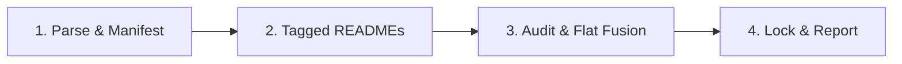

# vibe-add: Add Infrastructure Dependency

> **Normative Reference**: Strictly implements [prompts/shared-concepts.md](../prompts/shared-concepts.md).

---

## Execution Pipeline

### Stage 1: Parse Arguments & Register Manifest
1. Parse user input: `<git-url>` and target `<tag>` (default to latest tag if omitted).
2. Register or update the dependency entry in root `vibe.json` (always preserving `$schema`).

### Stage 2: Manifest Guardrail & Cognitive Grounding
1. **Manifest Guardrail**: Verify target upstream contains a root `vibe.json`. If missing, abort immediately.
2. **Cognitive Grounding (Tagged README Mandate)**:
   - Fetch and read the Base Infra repository's (`seho-dev/vibe-infra`) `README.md` at its declared tag (or resolved latest tag) to ground operational mental models.
   - Fetch and read the target repository's `README.md` at the resolved `<tag>` to ground domain understanding (e.g. Go standards, frontend design rules).
   *(Note: Tagged READMEs are read into working memory only; never copied to workspace).*
3. Detect host harness environment (e.g. Claude Code or other mainstream agentic tools). If ambiguous, prompt the user to specify their AI tool as required by `shared-concepts.md`.
4. Determine workspace mode:
   - **Consumer Mode**: Targeting native harness directories.
   - **Infra Author Mode**: Updating outer root assets directly.

### Stage 3: Security Audit & Flat Semantic Fusion
1. **Supply Chain Security Audit**: Inspect incoming configurations and prompt templates for secret leaks, command injection, or unauthorized network calls. Trigger Interactive Inquiry if detected.
2. **Flat Semantic Fusion**:
   - Filter files matching declared `includes` and not excluded by `excludes`.
   - **Single-Instance Rules (`AGENTS.md`)**: Semantically append and synthesize new guidelines; local domain logic strictly takes precedence.
   - **Modular Assets (`skills/`, `commands/`, `prompts/`)**: Map to native harness paths in consumer mode, or edit outer root assets in infra author mode without folder nesting. Homonymous files are synthesized with local patterns.
   - **Tooling Adaptation**: Map generic placeholders to actual project commands (`package.json`, `go.mod`).

### Stage 4: Atomic Lock & Execution Report
1. Record target version and resolved commit SHA into `vibe.lock`.
2. Output standard execution report matching the schema in `shared-concepts.md`.
