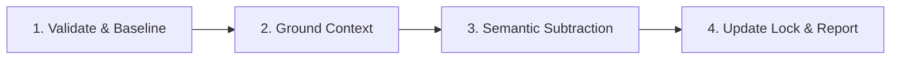

# vibe-remove: Remove Infrastructure Dependency

> **Normative Reference**: Strictly implements [prompts/shared-concepts.md](../prompts/shared-concepts.md).

---

## Execution Pipeline

### Stage 1: Validate State & Retrieve Baseline
1. Read `vibe.json` and `vibe.lock`.
2. Locate `<infra-name>` and retrieve its `resolvedCommit` to establish the reference baseline.
3. Detect host harness environment. If ambiguous, prompt the user to specify their AI tool. Determine workspace mode (Consumer vs. Infra Author).

### Stage 2: Mandatory Cognitive Grounding
1. Fetch and read Base Infra (`seho-dev/vibe-infra`) `README.md` at its declared tag (or resolved latest tag) to ground semantic subtraction rules.
2. Fetch and read target `<infra-name>`'s `README.md` at `resolvedCommit` to understand what guidelines and assets were originally contributed.
*(Note: Tagged READMEs are read into working memory only; never copied to workspace).*

### Stage 3: AI-Native Semantic Subtraction & Asset Cleanup
Leverage the upstream baseline at `resolvedCommit` as semantic ground truth:
1. **Exclusive, Unmodified Files**: Delete cleanly if semantic content matches the upstream baseline with zero local edits.
2. **Locally Customized Files**: If local adaptations exist, **do not delete**. Ask user via Interactive Inquiry whether to retain as unmanaged local rules.
3. **Fused Files (`AGENTS.md`, merged skills)**: Prune clauses with equivalent meaning to target baseline; strictly preserve local project rules and other active infras.

### Stage 4: Update Manifest & Report
1. Remove target entry from `vibe.json` and `vibe.lock`.
2. Output standard execution report matching the schema in `shared-concepts.md`.
