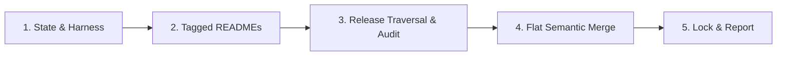

# vibe-sync: Synchronize & Upgrade Infrastructures

> **Normative Reference**: Strictly implements [prompts/shared-concepts.md](../prompts/shared-concepts.md).

---

## Execution Pipeline

### Stage 1: State & Harness Resolution
1. Detect host harness (such as Claude Code or other mainstream agentic tools). If ambiguous, prompt the user to specify their AI tool as required by `shared-concepts.md`.
2. Determine workspace mode:
   - **Consumer Mode**: Targeting native harness directories.
   - **Infra Author Mode**: If current repository is an infra repo (contains authoring `vibe.json`), commands in the harness read and modify outer root assets directly.
3. Read project root `vibe.json` and `vibe.lock`.
   - If `vibe.json` is missing: Halt and prompt user to initialize `vibe-infra`.
   - If `vibe.lock` is missing: Treat all entries as initial sync targets.

### Stage 2: Mandatory Cognitive Grounding
1. **Base Infra README Grounding**: Fetch and read the Base Infra repository's (`seho-dev/vibe-infra`) `README.md` at its declared tag (or resolved latest tag) in `vibe.json` into working context.
2. **Target Infra README Grounding**: For each declared entry in `vibe.json`, fetch and read its `README.md` at the target Git Tag to ground domain understanding (Note: Read for context only; never copy into workspace).

### Stage 3: Multi-Version Traversal, Audit & Flat Semantic Merge
For each declared infrastructure entry:
1. **Manifest Guardrail**: Verify upstream repository contains root `vibe.json`. If missing, reject and report error.
2. **Sequential Multi-Version Release Traversal**:
   - Compare target `version` (Git Tag) with `resolvedCommit` in `vibe.lock`.
   - If upgrading across multiple tags:
     1. Discover all intermediate Git Tags in `(currentVersion, targetVersion]`.
     2. Sequentially read GitHub Release Notes and Changelog entries in chronological order.
     3. Extract intermediate deprecations, breaking changes, and evolutionary rationale.
3. **Supply Chain Security Audit**: Inspect cumulative diff for sensitive credential access, suspicious shell commands, or silent outbound calls. Halt and trigger Interactive Inquiry if detected.
4. **Flat Semantic Merge**:
   - Filter files matching upstream `includes` and not excluded by `excludes`.
   - **Single-Instance Rules (`AGENTS.md`)**: Three-way semantic merge; **local business intent and build commands always win**.
   - **Modular Assets (`skills/`, `commands/`, `prompts/`)**: In consumer mode, place into native harness paths. In infra author mode, update root flat assets directly. Homonymous files are synthesized into unified documents.
   - **Deprecations**: Delete untouched obsolete files; prompt user if local customizations exist.
5. **Dynamic Stack Adaptation**: Resolve placeholders to native project toolchain (e.g. `go test ./...`, `pnpm test`).

### Stage 4: Atomic Lock & Execution Report
1. Update `vibe.lock` recording resolved commit SHAs, URLs, and current timestamp.
2. Emit the standard execution report matching the schema in `shared-concepts.md`.
