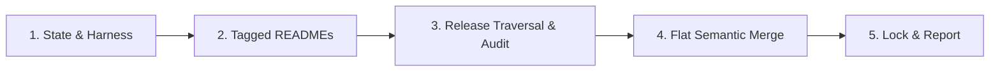

# vibe-sync: Synchronize & Upgrade Infrastructures

> **Normative Reference**: Strictly implements [prompts/shared-concepts.md](../prompts/shared-concepts.md).

---

## Execution Pipeline

### Stage 1: State & Harness Detection
1. Detect host harness according to `shared-concepts.md` (Claude Code, Cursor, OpenCode, or Generic).
2. Read project root `vibe.json` and `vibe.lock`.
   - If `vibe.json` is missing: Halt and prompt user to initialize `vibe-infra`.
   - If `vibe.lock` is missing: Treat all entries as initial sync targets.

### Step 2: Ground Semantic Context, Multi-Version Traverse & Security Audit
1. **Base Infra README Ingestion (Mandatory Context Grounding)**:
   - Always fetch and read the Base Infra repository's (`https://github.com/seho-dev/vibe-infra`) `README.md` at its pinned tag in `vibe.json`.
   - Internalize what vibe-infra is, its operating mental models, and the exact role each lifecycle command plays.
   *(Note: The README is read into working context only; never copied to project files).*

2. **Per-Infrastructure Processing**:
   For each declared infrastructure entry in `vibe.json`:
   - **Mandatory Guardrail**: Ensure upstream repository contains a root `vibe.json`. If missing, reject and report an error.
   - **Target Infra README Ingestion**:
     - Fetch and read the target repository's `README.md` at the resolved target tag.
     - Internalize the target infra's domain context (e.g., Go microservice patterns, frontend guidelines, or testing rules) to guide semantic interpretation.
   - **Sequential Multi-Version Traversal & Release Notes Aggregation**:
     - Compare target `version` (Git Tag) with `resolvedCommit` recorded in `vibe.lock`.
     - When upgrading across multiple version tags (e.g., `v1.0.0` -> `v1.3.0` jumping over `v1.1.0` and `v1.2.0`):
       1. **Tag Interval Discovery**: Enumerate all intermediate Git Tags/Releases within `(currentVersion, targetVersion]`.
       2. **Chronological Release Notes Reading**: Sequentially fetch and read GitHub Release Notes, Changelog entries, and commit summaries for each intermediate tag in chronological order.
       3. **Deprecation & Evolutionary Arc Analysis**: Synthesize maintainers' intentions across releases, explicitly tracking what was deprecated, newly introduced, or flagged as breaking.
     - Inspect the cumulative `git diff <old-commit>..<new-tag>` informed by this sequential multi-version release context.
   - **Supply Chain Security Audit**:
     - Audit incoming diffs for high-risk modifications (e.g., unauthorized network requests, credential leaks, invasive file modifications, or dangerous shell commands).
     - If unexpected security implications are found, immediately halt and prompt the user.
### Stage 2: Mandatory Cognitive Grounding
1. **Base Infra README Grounding**: Fetch and read the Base Infra repository's (`seho-dev/vibe-infra`) `README.md` at its pinned tag in `vibe.json` into working context.
2. **Target Infra README Grounding**: For each declared entry in `vibe.json`, fetch and read its `README.md` at the target Git Tag to ground domain understanding (Note: Read for context only; never copy into workspace).

### Stage 3: Multi-Version Traversal, Audit & Flat Semantic Merge
For each declared infrastructure entry:
1. **Manifest Guardrail**: Verify upstream repository contains root `vibe.json`. If missing, reject and report error.
2. **Sequential Multi-Version Release Traversal**:
   - Compare target `version` (Git Tag) with `resolvedCommit` in `vibe.lock`.
   - If upgrading across multiple tags (e.g., `v1.0.0 -> v1.3.0`):
     1. Discover all intermediate Git Tags in `(currentVersion, targetVersion]`.
     2. Sequentially read GitHub Release Notes and Changelog entries in chronological order.
     3. Extract intermediate deprecations, breaking changes, and evolutionary rationale.
3. **Supply Chain Security Audit**: Inspect cumulative diff for sensitive credential access, suspicious shell commands, or silent outbound calls. Halt and trigger Interactive Inquiry if detected.
4. **Flat Semantic Merge**:
   - Filter files matching upstream `includes` and not excluded by `excludes`.
   - **Single-Instance Rules (`AGENTS.md`, `.cursorrules`)**: Three-way semantic merge; **local business intent and build commands always win**.
   - **Modular Assets (`skills/*.md`, `commands/*.md`)**: Place flatly in native harness paths without folder nesting. Homonymous files are synthesized into unified documents.
   - **Deprecations**: Delete untouched obsolete files; prompt user if local customizations exist.
5. **Dynamic Stack Adaptation**: Resolve placeholders to native project toolchain (e.g. `go test ./...`, `pnpm test`).

### Stage 4: Atomic Lock & Execution Report
1. Update `vibe.lock` recording resolved commit SHAs, URLs, and current timestamp.
2. Emit the standard execution report matching the schema in `shared-concepts.md`.
